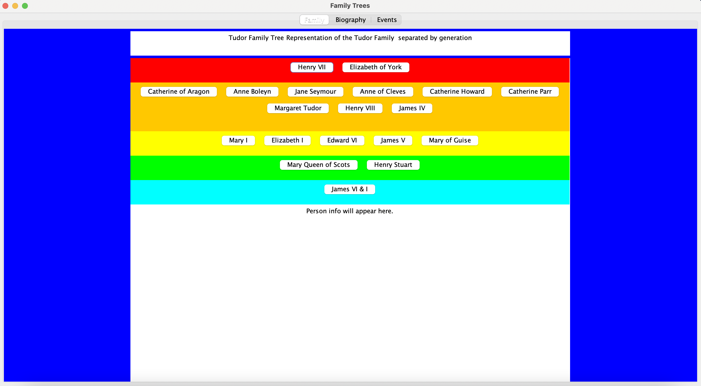
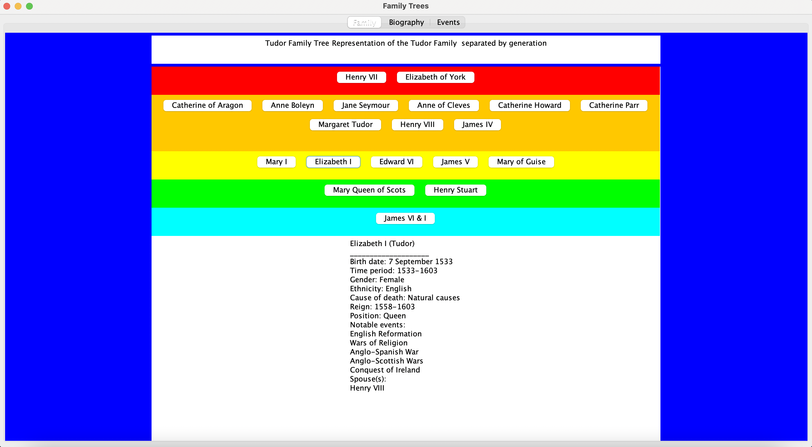
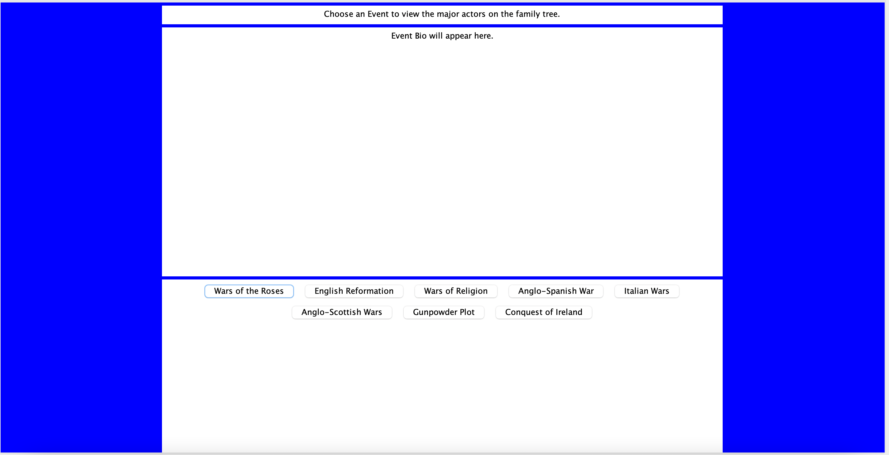
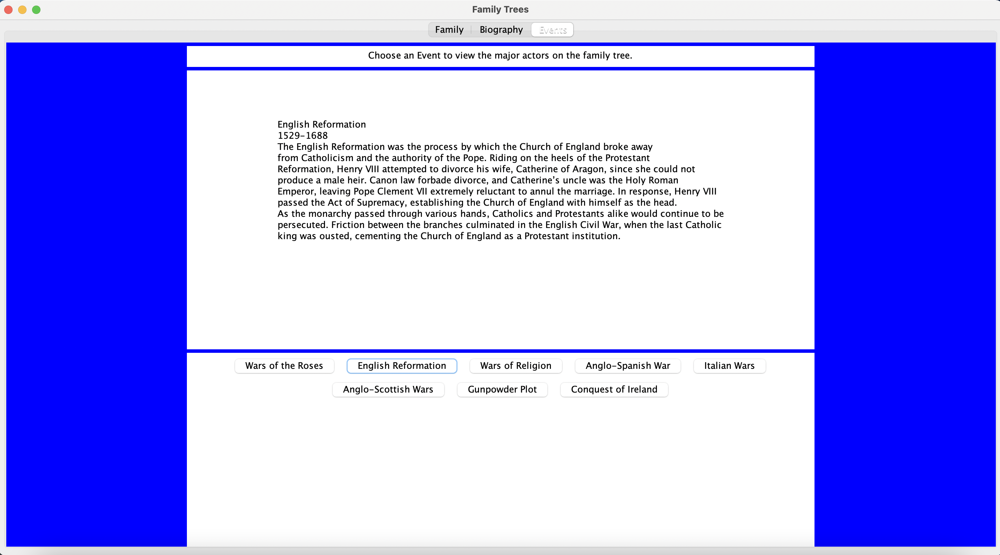
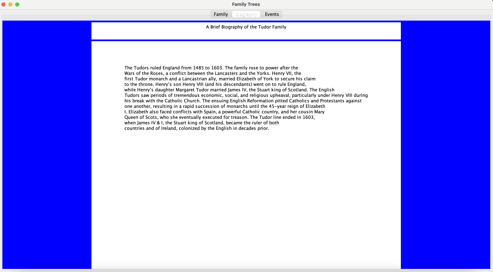

# Tudor Family Tree
An interactive Java GUI for exploring the history of the Tudor dynasty.

## Description
The Tudor Family Tree is an interactive Java GUI that lets the user explore the history of the Tudor dynasty. The Tudors were the ruling family of England from the late 1400s to the early 1600s. The user can get a visual of the different generations of the family, learn historical highlights about each family member, understand how the Tudors were connected to major events in early modern British history, and read a brief biographical overview of the dynasty.

The **Person** class was created to hold information about each Tudor family member--their birth and death dates, cause of death, title (e.g., Queen), any notable events, etc.

The **SingleEvent** class was created to hold information about each Tudor historical event--the event's name, time period, and a brief description. The **Event** class contains a **Vector** that holds all the events in which the Tudors were involved, which we used to create the Events tab in the GUI.

The **Family** class relates the different Person objects to one another using a **Graph**. Each family member is a node, and the edges link parents and children. Though we initially planned to use a Tree, that would have limited the number of relationships we could store, since one child would have to link a single root. Each Person was stored in a **HashTable**, using their name as the key and the Person object as the value.

The **FamilyTree** class uses another **HashTable** to link the family name with their Family object, using their surname as the key and the Family object as the value. Though we only ended up creating a family tree for the Tudor dynasty, we initially envisioned the project including other families of historical importance, so we wanted to create flexible, scalable code.

The **FamilyTreeGUI** class uses Java Swing to create the interactive UI, including the Family panel, Biography panel, and Events panel.

## Images
When you run the program, it opens on the Family tab, with the Tudor family tree:

When you click on a family member, it brings up their biographical information at the bottom:

When you navigate to the Events tab, it gives you a choice of important events in Tudor history:

When you click on an event, it brings up some brief historical information at the top:

When you navigate to the Biography tab, it shows you a brief biographical overview of the Tudor dynasty:

## Technologies
* Java
* Swing

## Issues & ideas
* Add more historical family options
* Highlight family members in the Family panel who were involved in an event when the event is selected in the Events panel
* GUI redesign for better user experience (e.g. adding visual connections between family members in family tree)

## Instructions
If you have Java installed, you can download the zip file and run the GUI from the command line using `java FamilyTreeGUI`.

## Credits
This was the capstone project for the CS 230 (Data Structures) course at Wellesley College. I worked with two other classmates. Though the entire project was done collaboratively, I was primarily responsible for building the Person class, the Family class, and doing all the historical research and formatting it for easy input.

All data structures were instantiated from the Java Foundations classes, which accompanied our Java Foundations course textbook.

